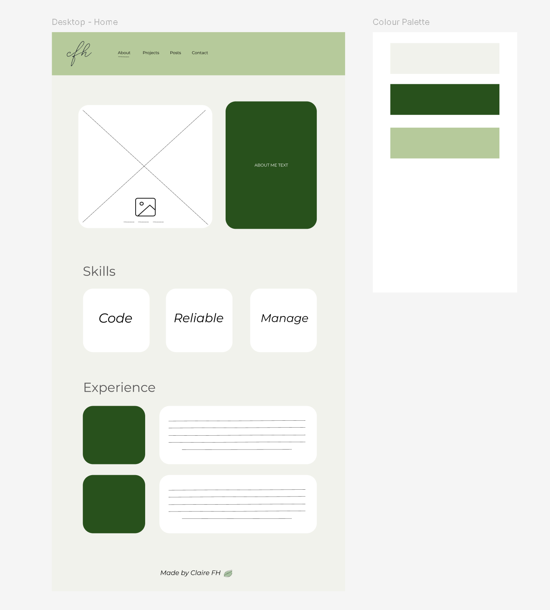

# claire-fh

Website

## Deployment

Currently via Netlify continuouse deployment. However, for more interesting work there is a consideration of 1. serving this from a gcp bucket and 2. containerising and deploying from cloud run or kubernetes. If the website ever had a backend and wasn't static files then number 1 would become less valid.

Notes: https://cloud.google.com/storage/docs/hosting-static-website
Deployment to the bucket could be done in the github CI.
https://codelabs.developers.google.com/codelabs/cloud-run-deploy

Solution 2 with k8s or cloud run is really more useful to practice deployments to these and not a normal usecase for a static website.

## Design and Project Iteration
In the project folder there is information about each iteration of the website as I complete the CFG Intro to Web Dev course.

Design of the project is also captured here from Figma!

### Design One

